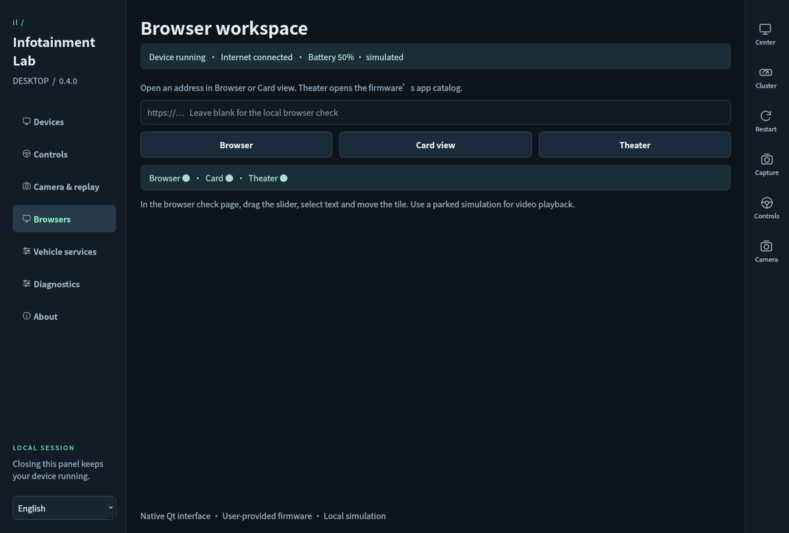
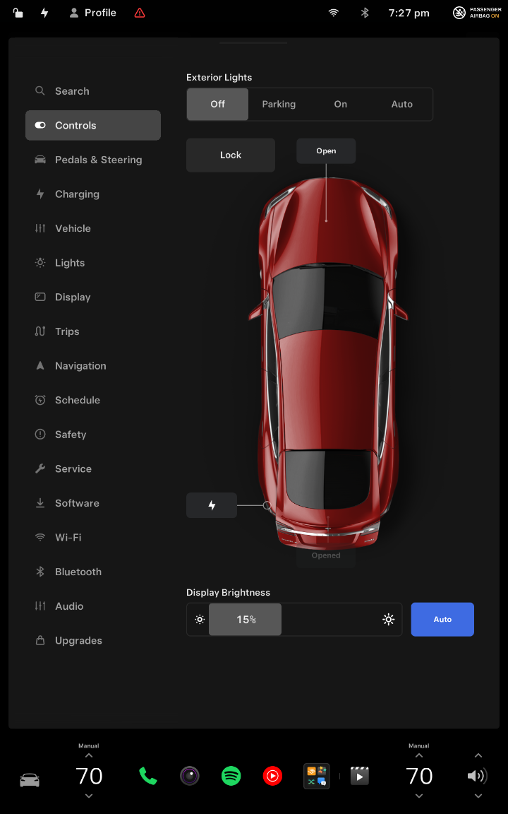
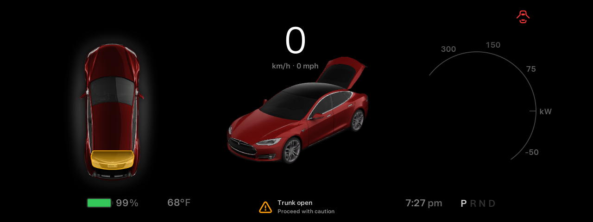
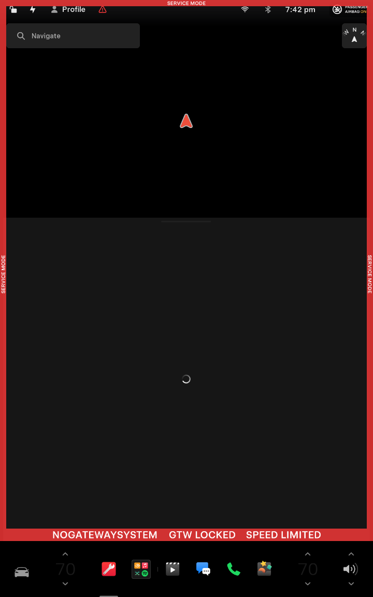
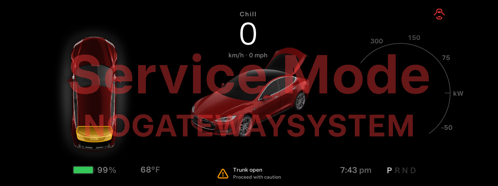
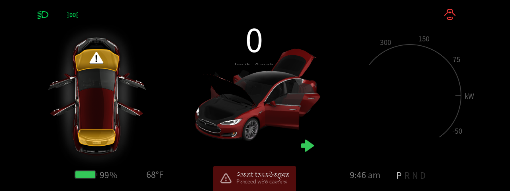
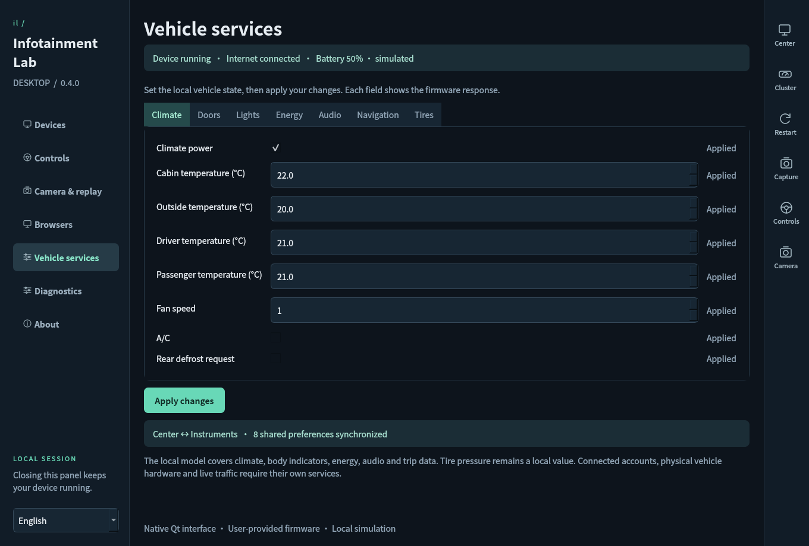

# Infotainment Lab

[简体中文](README.zh-CN.md)

A native Linux desktop application for running and studying infotainment software on your own computer. Drop in a supported firmware image and open the real center display and instrument cluster as desktop windows. The Python/Qt control panel runs directly on Linux or Windows WSLg.

Version **0.5.0** introduces the Material desktop, removes the upper-left wordmark, and adds an experimental QEMU desktop with accelerated dual displays, buffered WSLg audio and integrated Qt controls. The tested firmware is **2026.26.6.1 · Model S/X · MCU2 (`modelsx_info2`)**. See the [changelog](CHANGELOG.md) for details.

## Material desktop

The native Qt panel now uses a Material 3 inspired design across all seven pages. Choose **System**, **Light** or **Dark** appearance and an **Iris / Blue / Leaf** accent from the sidebar. Below 1220 pixels wide, the navigation collapses to icons; its bottom settings menu keeps appearance and language available. Theme changes preserve your current controls and form edits.

These are actual Debian WSLg Qt captures of the updated control panel with the firmware session stopped. They show the desktop design, not QEMU firmware completion. The 0.5.0 packages include this interface.


## Bring your own firmware

**This repository and its downloads do not include Tesla firmware.** You must independently obtain or export a compatible **Firmware Dump** that you have permission to use. This project does not provide firmware downloads, extraction tools, or instructions for obtaining or exporting a dump.

Without your own supported dump, you can open the control panel, but you cannot start the infotainment system. Import your dump after setting up the app; fonts and other vehicle assets are read from that image. Optional map packages must also be supplied separately.







## What works

| Feature | Current behavior |
| --- | --- |
| Native desktop | Bilingual device manager, guided setup, searchable firmware library, drag-and-drop import, persistent error messages and scrollable pages. |
| Device lifecycle | Exact build checks, read-only FUSE mounts, saved launch choices, bounded process recovery, restart and stop. |
| Multiple windows | Interactive center and instrument displays, control panel and optional camera preview. The toolbar raises either display and exports both as PNGs. |
| Graphics | Actual host renderer is reported. Tested on AMD Radeon through Mesa D3D12 in WSLg. This MCU2 visualization uses Godot. |
| Native fonts | Center and cluster use Universal Sans and fallback fonts from your selected firmware. The 3D texture upload preserves Qt's glyph alignment. |
| Embedded Chromium | Browser and Card views, native Theater catalog, keyboard input, wheel scrolling, text selection and dragging. Runtime status distinguishes the launched Chromium processes. |
| Internet and storage | Measured host connectivity and real Linux filesystem capacity. Battery starts at a simulated 50% and is editable. |
| Driving controls | P/R/N/D, dummy speed, accelerator, brake, steering and turn signals. Both displays receive the shared local inputs. |
| Camera and replay | Test pattern, looping video or an existing RGB24 pipeline feeds the firmware camera. Embedded dashcam telemetry follows the decoded video frame, with pause, seek, speed, loop and manual takeover. |
| Vehicle services | Local climate, closure indicators, lights, battery/charging, audio and navigation metadata, with per-display readback. Native climate/audio changes feed back to the control panel. |
| Display synchronization | Shared driving/service state, Santa and supported theme/wheel preferences; center-owned playback metadata is sent to the instruments. Unsupported fields remain visible in diagnostics. |
| Maps | Inspect/mount a supplied NA image. A street base map rendered after replay supplied valid GPS; use of the offline NA package and routing remain unverified. |

Browser/Card interaction and the Theater catalog/YouTube home page have been checked inside the firmware UI. Commercial streaming playback, DRM, sign-in-dependent services and every web application have not been validated. Physical vehicle and cloud-only services are not connected; tire pressures remain values in the local model. See the [compatibility matrix](docs/compatibility.md) for the precise scope.

## Start on Linux or Windows WSL

You need **x86_64 Linux**, an X11/XWayland desktop, systemd user services, FUSE, and a supported image you have permission to use. **Debian 13 under WSL2 is the tested environment.** Physical Linux launch support is implemented but has not been checked on a separate machine.

On Windows, install Debian with WSL2 and follow Microsoft's [Linux GUI application setup](https://learn.microsoft.com/en-us/windows/wsl/tutorials/gui-apps). Run the app as a normal Linux user.

### Downloaded bundle

1. Extract the complete Linux archive to a permanent folder, keeping `_internal` beside the executable.
2. On Linux, run `bash Launch-Linux.sh`. On Windows, double-click **Launch-WSL.cmd** in that folder to open the Linux GUI in Debian.
3. Select **Prepare computer** if setup is needed. The app checks display access, user services, FUSE and runtime packages. Package installation uses Debian/Ubuntu's package manager and its administrator flow.
4. Drop in your own supported firmware dump (tested: `2026.26.6.1.mcu2`), wait for inspection, then select **Start device**. Instrument display, Chromium and map choices are remembered for that image.
5. Use **Center** and **Cluster** in the top toolbar to interact with the firmware windows. **Capture** saves both displays as PNG files.

**Restart** returns manual driving controls to Park; a selected recording waits for Play. **Stop** ends the device session and its workers. Closing the control panel leaves the session, camera and any active replay running. Opening the launcher again brings the existing control panel forward.

The Devices overview shows real captures refreshed every five seconds while that page is visible. Interact in the separate display windows. **Ctrl+O** adds firmware; **Ctrl+1 / 2 / 3** opens Devices, Controls and Camera & replay.

Optional: run `python3 install-desktop.py` beside the extracted executable to add a Linux menu entry. WSLg can expose it in Windows. Local bundles are built and tested on Debian 13 with glibc 2.41; older glibc versions have not been validated. CI is configured to build on Ubuntu 22.04 for a broader baseline. Use source mode when a bundle does not match your distribution.

### Run from source

Install Python 3.11+ and `python3-venv`, clone or extract this repository, then run:

```bash
bash Launch-Linux.sh
```

The first launch creates `~/.local/share/tsla-infotainment-lab/ui-venv` and installs the pinned Qt binding. Use **Prepare computer** for the remaining runtime packages. On Windows, double-click **Launch-WSL.cmd**; for another distribution, run `Launch-WSL.ps1 -Distribution <name>` from PowerShell.

To install desktop and Start-menu shortcuts that open the Linux GUI without a console, run `powershell.exe -NoProfile -File scripts/install-wsl-shortcut.ps1` from the repository. The Linux bundle places this installer in its top-level folder.

The optional Windows control-panel ZIP opens with **InfotainmentLab.exe** after full extraction. Keep `_internal` beside the executable. Its backend also runs in Debian WSL.

If no window appears, run **Launch-WSL.cmd** from the application folder so startup errors stay visible. The Linux launcher records the latest attempt in `~/.local/state/tsla-infotainment-lab/launcher.log`. Once a device is running, use **Center** or **Cluster** to raise its display window.

## Browser workspace

Open **Browsers**, enter an HTTP/HTTPS address and select **Browser** or **Card view**. Leave the address empty to open the bundled interaction check. **Theater** opens the firmware's app catalog; choose an app there.

Browser and Card share the same browser app and profile.

The source checkout also starts the firmware's dedicated music browser, media
web app, adapter and Spotify service. Host connectivity reaches the native
Spotify SDK. Open Spotify from the center display; an account is still needed
for playback. On the current WSL host, the firmware rejects the media service
security context, so Spotify login and playback are still unavailable. The
Browsers page reports this native connection failure.

The local check page includes a draggable tile, range slider, text selection, audio and WebGL checks. Live validation inside embedded Chromium recorded drag motion and release events and moved the range value from 20 to 85. These checks exercise the firmware's embedded view at its actual display scale.

 

## Camera and recorded drives

In **Camera & replay**, choose **Test pattern**, **Open video…**, or connect the existing pipeline. Open the camera app on the center display, or select R for an ordinary backup-camera test. The firmware's native camera page renders the frames. Pattern and H.264 input have been measured at about 24 fps on the tested WSLg host; the control-panel preview refreshes once per second.

To replay a recorded drive, choose **Open dashcam MP4…** and select a clip with embedded telemetry. Play, Pause, the timeline, 0.25×–2× speed and Loop control the video and driving data together. Gear, speed, accelerator, brake, steering and turn signals follow the committed video frame. Valid recorded GPS/heading are delivered to both displays; acceleration and assistance-state codes remain recording metadata.


To try replay without a personal recording, run `python3 scripts/make-replay-demo.py`
from the source checkout, then select `build/replay-demo.mp4`. The generator uses
FFmpeg to create a 12-second clip with 288 embedded samples and no GPS location.

Pause holds the current frame and inputs. Seeking decodes the target frame before publishing its data. **Take over**, or changing a manual driving control, releases the recording's control of the simulator. Press Play to resume. A recorded D gear stays D: open the firmware camera page explicitly to watch the recording while retaining its gear data.

For the existing pipeline, start its writer and enter its output path, normally `/tmp/tesla-sim/v4l2-back.rgb`. The format is **1280 × 720 RGB24, 2,764,800 bytes per frame**, published with an atomic file replacement. The application reads the upstream file without modifying it. Missing/stale input shows a waiting state; **Stop feed** clears the image. A working source can resume without restarting the firmware.

**Firmware receiving** requires both fresh source frames and recent V4L2 consumption. **Source ready** means the source runs while the firmware camera page is closed. One camera view is selected at a time; the native backup-camera view is validated. See [replay formats and ownership](docs/replay.md).

## Driving controls and vehicle services

Select a gear and set dummy speed directly in **Controls**. Park resets speed and accelerator to zero. Pedals are independent inputs, with brake represented as a pressed/released display flag. Steering uses wheel degrees; the illustrative turning radius assumes a 2.96 m wheelbase and 14.8:1 steering ratio. Native displayed speed is rounded to a whole number in the selected Miles/Kilometers units.

**Steering-wheel buttons** control volume, mute, play/pause and track selection
through the native player. The right group opens the instrument volume, wiper
and voice panels. Opening the voice panel does not provide speech recognition.
Hold Volume + or − for repeated adjustment; releasing, leaving the button or
switching windows stops repetition. Other buttons issue one action per press.
Left, right and hazard signals drive the native instrument arrows with an
800 ms blink cycle; selecting Off clears both lamps.


**Vehicle services** groups climate, doors, lights, energy, audio, navigation and tire values. Edit the fields and choose **Apply changes**. Each row shows the firmware response. Changing native climate or audio controls updates the same shared model, and supported preferences synchronize from either display.

Each door and trunk now drives its own native 3D position. Center-display trunk
and lock buttons feed the local model. Exterior lights support Off, Parking, On
and Auto; Auto follows the **Dark outside** input. The Services page also contains
the normal Service Mode entry instructions. The center and instrument displays
now enter their native Service Mode after the ordinary access-code flow. Full
diagnostic gateway routines and Service Mode Plus are not implemented.









An applied value means the native data interface read it back. Door controls currently provide open/closed indicators and lock state; individual 3D latch animations remain unverified. Charging and temperatures are supplied values, not physical models. Navigation metadata does not provide a route engine. See [vehicle service details](docs/vehicle-services.md).

## Engineering and contribution

This project demonstrates compatibility engineering and cybersecurity-oriented systems work: graphics interoperability, native input routing, process ownership, reproducible build identification, parser validation and runtime diagnostics. Firmware files remain unchanged. Source-built adapters bridge exported Qt/X11 interfaces and the host graphics stack. All simulator traffic stays within this application's local session.

See [architecture](docs/ARCHITECTURE.md), [compatibility](docs/compatibility.md), [validation](docs/VALIDATION.md) and [security boundaries](SECURITY.md). Screenshots are captures of the running application and firmware display. Public replay screenshots use synthetic demo footage and telemetry; personal recordings and GPS are excluded.

```bash
python3 -m venv .venv
source .venv/bin/activate
python -m pip install -e '.[dev]'
python -m pytest -q
python scripts/build.py
```

On Windows use `.venv\Scripts\Activate.ps1`. Build on the target OS; PyInstaller is not a cross compiler. Artifacts go to `dist/`. CI tests and packages the source without firmware; it does not publish a release automatically.

The repository excludes firmware, maps, recordings, browser profiles, runtime logs and credentials. [Contributions](CONTRIBUTING.md) should include reproducible evidence and remaining limitations.

Independent project, not affiliated with or endorsed by Tesla. Project source is MIT licensed. Firmware, trademarks, screenshots of third-party interfaces, Qt and other dependencies retain their respective rights; see [third-party notices](THIRD_PARTY_NOTICES.md).

### Experimental MCU2 compatibility

Model S/X firmware with the `modelsx_info2` variant can use an experimental generic profile when no exact profile exists. Startup checks both display executables for x86_64 ELF format and checks media entry points when browsers are enabled. These checks do not establish ABI or runtime compatibility. The tested 2026.26.6.1 profile retains its build-ID checks. Other platforms still require their own launcher.

### Experimental ICE compatibility

The device manager also offers a bounded [QEMU vendor-kernel boot check](docs/qemu.md). Full firmware boot and desktop parity are **not implemented** by this check.

A separate [QEMU virtual desktop](docs/virtual-desktop.md) now runs MCU2's real dual-screen UI and browser card with a replacement Linux kernel. Select QEMU in the Qt panel to use its previews, driving controls and camera/replay inputs. Both displays use AMD-backed VirGL; VirtualGL shares the accelerated GPU with the separate instrument window. Buffered WSLg audio passes playback and idle/resume checks; long-session audio and complete feature parity still need validation. The guide includes setup and validation details.

Firmware identifying itself as `product=ice` and `product-platform=mrb` now uses a single landscape display. Empty product variants are handled during import. The launcher uses native-resolution raster presentation for QtCar and starts the original Godot visualization separately on the center display. The 2026.26.6.5 image has displayed the native UI, map and vehicle model in WSL Debian. Chromium and media processes start, but streaming playback and complete feature compatibility remain unverified. Re-import older library entries to refresh platform identification.
