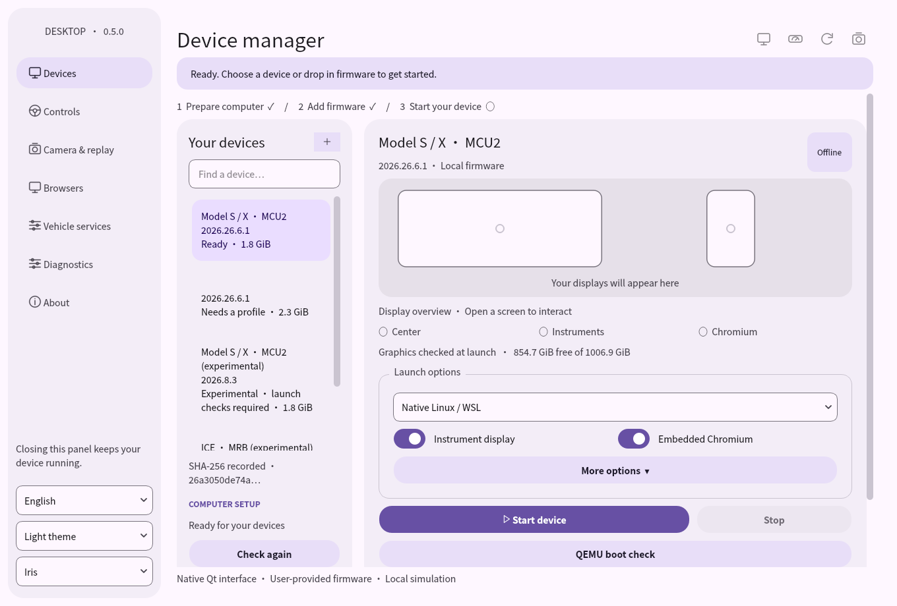
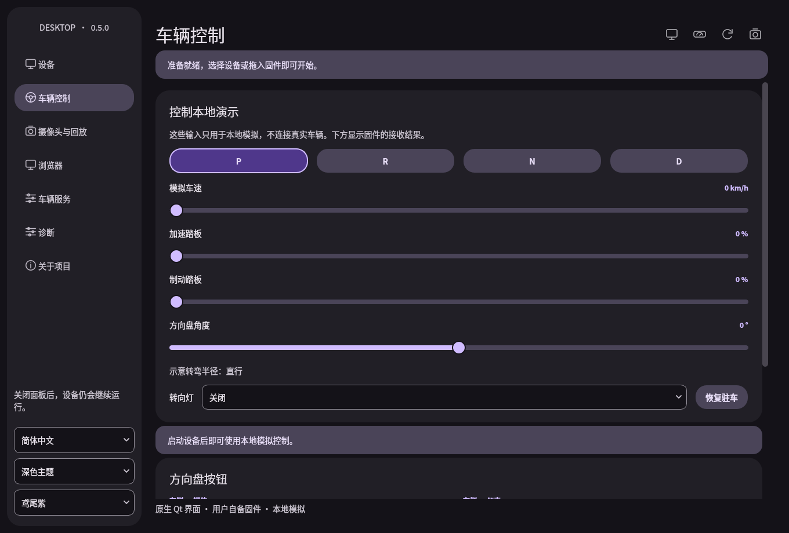
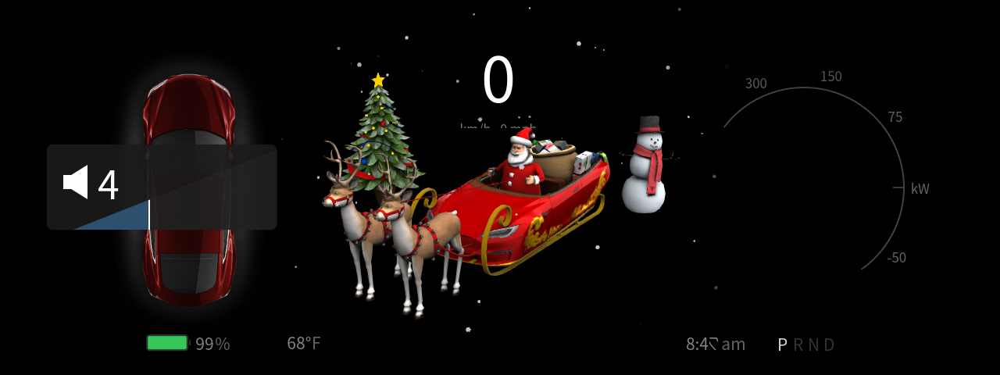
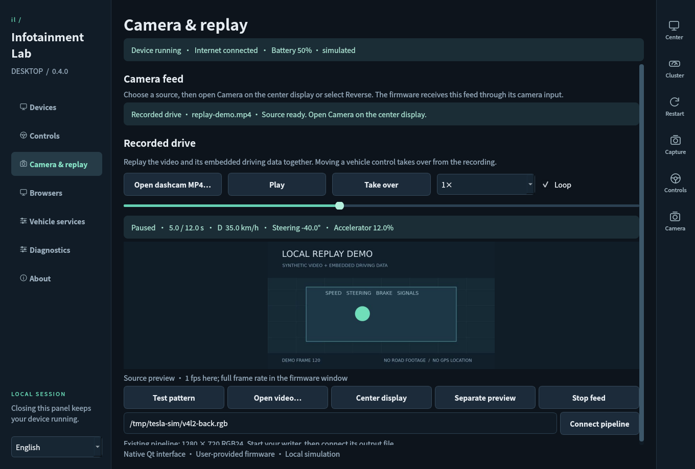

# Infotainment Lab

[简体中文](README.zh-CN.md) · [Download](https://github.com/derrickyau9/tsla-infotainment-lab/releases/latest) · [Changelog](CHANGELOG.md)

Run infotainment software on your own computer, with the center display and instrument cluster in separate desktop windows. A native Qt app handles your firmware library, driving controls, browser windows, cameras, and recorded drives.

Infotainment Lab runs on Linux and Windows with Debian WSL2. The Material 3 control panel supports native and QEMU desktop sessions. **0.5.1** fixes native startup and QEMU idle-display stalls.



## Bring your own firmware

**You need your own compatible Firmware Dump.** Firmware and maps are not included in this repository or its downloads. Obtain a dump you have permission to use; this project does not provide extraction tools or export tutorials.

The app reads fonts and vehicle assets from your selected image. Model S/X MCU2 images use a center display and instrument cluster; ICE images use a landscape center display. The built-in MCU2 profile is for **2026.26.6.1**. Other versions use the matching platform profile.

## Get started

You need an x86_64 computer and a Linux graphical desktop. On Windows, install **Debian under WSL2** with [WSLg support](https://learn.microsoft.com/en-us/windows/wsl/tutorials/gui-apps).

1. Download and fully extract a release archive. Keep the `_internal` folder beside the executable.
2. For the Linux app, run `bash Launch-Linux.sh`, or double-click **Launch-WSL.cmd** on Windows. The Windows control-panel package starts with **InfotainmentLab.exe**.
3. Select **Prepare computer** to install the Linux runtime components.
4. Drop your firmware image into **Devices**, select it, then choose **Start device**.
5. Use **Center** and **Cluster** in the toolbar to bring a display forward. **Capture** saves both screens as PNGs.

Run the app as your normal desktop user. Setup asks for administrator access when it needs to install packages. Linux binary downloads require glibc 2.41 or newer.

Closing the control panel leaves the session running. **Stop** ends it; **Restart** starts again in Park. Device settings and your selected map package are remembered.

### From source

Install Python 3.11+ and `python3-venv`, then:

```bash
git clone https://github.com/derrickyau9/tsla-infotainment-lab.git
cd tsla-infotainment-lab
bash Launch-Linux.sh
```

The launcher creates a Python environment and installs Qt on first use. On Windows, use **Launch-WSL.cmd** from the checkout. To select another distribution, run `Launch-WSL.ps1 -Distribution <name>` in PowerShell.

For a Start-menu shortcut, run `scripts/install-wsl-shortcut.ps1`. If the window does not open, launch from a terminal and check `~/.local/state/tsla-infotainment-lab/launcher.log`.

### QEMU mode

Choose **QEMU** in Devices to run the desktop inside a Debian guest. The panel manages startup, shutdown, dual-screen previews, browser cards, driving inputs, and camera replay. MCU2 uses VirGL for graphics, with VirtualGL sharing the GPU with the instrument window.

QEMU uses a replacement Linux kernel and your read-only firmware image. Prepare the guest disk locally using the [QEMU desktop guide](docs/virtual-desktop.md).

## Make it yours

Choose System, Light, or Dark appearance and an Iris, Blue, or Leaf accent. Smaller windows switch to compact navigation. English and Simplified Chinese are available throughout the control panel.



## Driving and instruments

Select P, R, N, or D and adjust speed, accelerator, brake, steering, and turn signals in **Controls**. Both displays receive the same local inputs. Park resets speed and accelerator to zero.

The steering-wheel buttons control volume, mute, playback, and tracks. Hold Volume + or − for continuous adjustment. The right-hand buttons open instrument panels. Santa mode and supported display preferences carry across both screens, along with music titles and playback information.



**Vehicle services** brings together climate, doors, lights, energy, and audio. Open a door, change the battery level, or switch the headlights; the panel shows the firmware's response. Changes made through the native climate and audio controls feed back into the panel. See the [vehicle services guide](docs/vehicle-services.md).

These controls operate the local desktop session. They do not connect to a physical vehicle.

## Browser workspace

Open **Browsers**, enter an address, and choose **Browser** or **Card view**. **Theater** opens the firmware's app catalog. Browser and Card share a profile, with keyboard input, scrolling, text selection, and dragging inside the embedded view.

Leave the address empty to open a local page with audio, text input, dragging, and WebGL examples. Music apps open from the center display and use their own account sign-in.

 

## Cameras and recorded drives

In **Camera & replay**, choose a test pattern, open a video, or connect an existing RGB pipeline. Open the camera on the center display, or select R for the backup-camera view.

Choose **Open dashcam MP4…** to play a recording with embedded driving data. Gear, speed, pedals, steering, and indicators follow the video. Pause, seek, playback speed, and looping apply to both. **Take over** returns control to you; Play resumes the recording.



To try a sample recording, run `python3 scripts/make-replay-demo.py` and open `build/replay-demo.mp4`.

An existing camera pipeline can publish **1280 × 720 RGB24** frames through an atomically replaced file, such as `/tmp/tesla-sim/v4l2-back.rgb`. Enter that path in the panel. See [camera and replay formats](docs/replay.md) for the details.

## Development

This is an independent compatibility and cybersecurity engineering project. It brings together native graphics, input routing, process management, and local simulation while keeping the supplied firmware unchanged.

See the [architecture](docs/ARCHITECTURE.md), [compatibility notes](docs/compatibility.md), and [contribution guide](CONTRIBUTING.md).

```bash
python3 -m venv .venv
source .venv/bin/activate
python -m pip install -e '.[dev]'
python -m pytest -q
python scripts/build.py
```

On Windows, activate with `.venv\Scripts\Activate.ps1`. Build on the target operating system; output goes to `dist/`.

Firmware, maps, recordings, browser profiles, logs, and credentials stay out of the repository. Public replay screenshots use generated footage.

Not affiliated with or endorsed by Tesla. Project code is MIT-licensed; firmware, trademarks, screenshots of third-party interfaces, and dependencies retain their respective rights. See [third-party notices](THIRD_PARTY_NOTICES.md).
