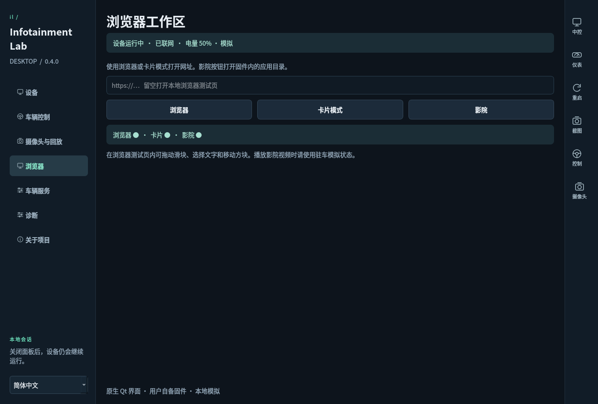
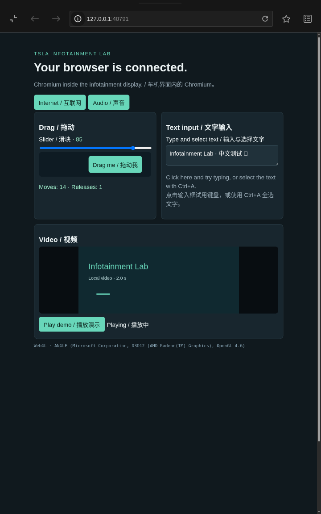
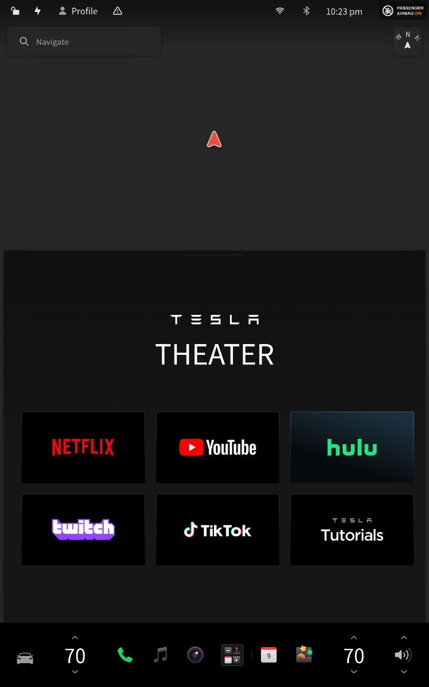
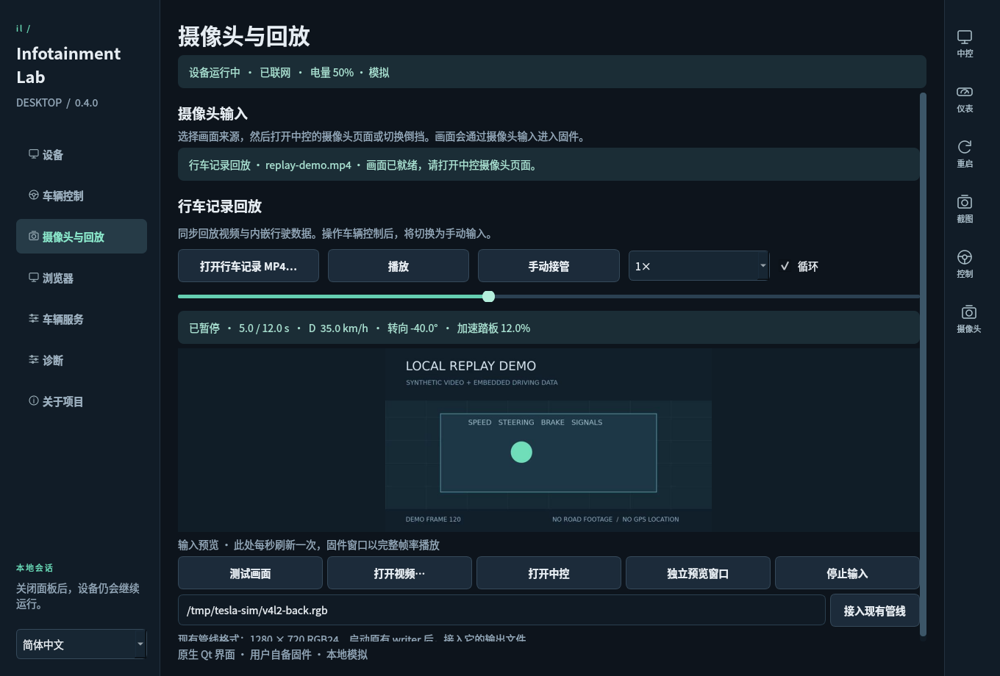
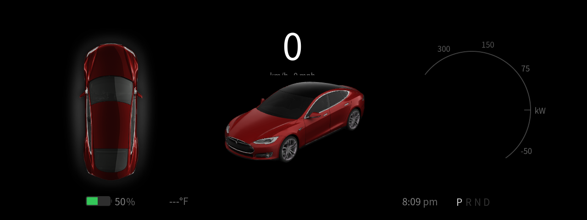
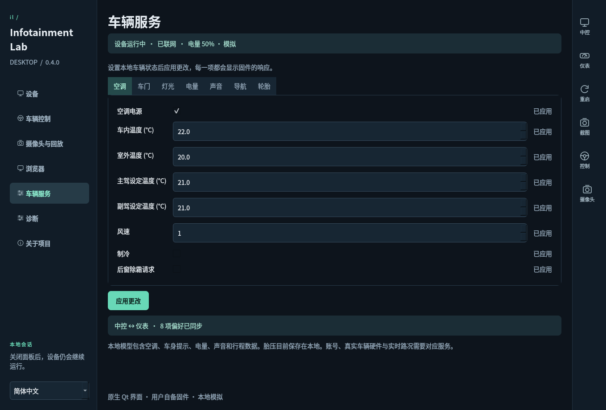

# Infotainment Lab · 车机实验室

[English](README.md)

一个使用 Python 与 Qt 编写的**原生 Linux 桌面应用**。导入自备的适配固件，即可在独立桌面窗口中运行真实车机中控与仪表界面。控制面板直接在 Linux 或 Windows WSLg 中启动。

**0.4.0** 加入了内嵌 Chromium 浏览器／卡片模式、固件影院目录、本地车辆服务，以及视频与内嵌行驶数据同步回放。经过验证的固件为 **2026.26.6.1 · Model S/X · MCU2（`modelsx_info2`）**。



## 当前能力

| 功能 | 实际状态 |
| --- | --- |
| 原生桌面 | 中英文设备管理、引导式环境准备、固件搜索、拖放导入、保留错误提示，以及可滚动页面。 |
| 设备管理 | 精确构建校验、只读 FUSE 挂载、记忆启动选项、有限次数故障恢复、重启与停止。 |
| 多窗口 | 可交互的中控、仪表、控制面板与可选摄像头预览；工具栏可唤起显示窗口或导出双屏 PNG。 |
| 图形加速 | 显示实际渲染器，已在 WSLg 的 AMD Radeon / Mesa D3D12 上验证。本适配的 MCU2 可视化使用 Godot。 |
| 内嵌 Chromium | 浏览器与卡片模式、原生影院目录、键盘、滚轮、文字选择和拖动；分别显示已启动 Chromium 进程的运行状态。 |
| 网络与容量 | 实测宿主网络状态和 Linux 文件系统容量。模拟电量默认 50%，可在车辆服务中修改。 |
| 行驶控制 | P/R/N/D 挡位、模拟车速、油门、刹车、方向盘和转向灯；两屏接收同一份本地输入。 |
| 摄像头与回放 | 测试画面、循环视频或现有 RGB24 管线接入固件摄像头。内嵌行驶数据跟随实际解码画面，支持暂停、跳转、倍速、循环和手动接管。 |
| 车辆服务 | 本地空调、车门提示、灯光、电量／充电、声音与导航元数据，逐屏回读结果；在固件内修改空调和声音也会更新控制面板。 |
| 双屏同步 | 共用行驶与车辆服务状态，双向同步可用的单位、音量与时间偏好；不支持的字段保留在诊断中。 |
| 地图 | 检查／挂载自备 NA 镜像。回放提供有效 GPS 后已看到街道底图；离线 NA 图包的使用及路线服务仍未验证。 |

已在固件 UI 内验证浏览器、卡片交互，以及影院目录和 YouTube 首页。商业流媒体播放、DRM、需要登录的服务和全部网页应用尚未验证。真实车辆与云端专用服务没有接入；胎压目前保存在本地模型中。具体范围见[兼容性表](docs/compatibility.md)。

## 启动

需要 **x86_64 Linux**、X11/XWayland 桌面、systemd 用户服务、FUSE，以及你有权使用的适配镜像。**已验证环境为 WSL2 中的 Debian 13。** 独立 Linux 启动支持已实现，尚未在另一台实体机器上验证。

Windows 请先安装 WSL2 与 Debian，按照微软的 [Linux 图形应用说明](https://learn.microsoft.com/en-us/windows/wsl/tutorials/gui-apps)配置环境，并以普通 Linux 用户运行应用。

### 使用发布包

1. 将 Linux 压缩包完整解压到固定目录，让 `_internal` 与可执行文件保持相邻。
2. Linux 下运行 `bash Launch-Linux.sh`；Windows 下双击该目录的 **Launch-WSL.cmd**，即可在 Debian 中打开 Linux GUI。
3. 若环境未就绪，点击“准备运行环境”。应用会检查显示、用户服务、FUSE 与依赖，并使用 Debian/Ubuntu 软件包管理器及其管理员流程安装依赖。
4. 拖入 `2026.26.6.1.mcu2`，检查完成后点击“启动设备”。仪表、Chromium 和地图选择会按设备记忆。
5. 点击右侧“中控”或“仪表”操作真实显示窗口；“截图”可以导出双屏 PNG。

“重启”会把手动行驶输入恢复为 P 挡；已选中的回放会等待再次播放。“停止”会结束设备及其后台进程。仅关闭控制面板会保留设备、摄像头和正在播放的录像。再次打开启动器会唤起已有控制面板。

设备页显示真实双屏截图，在该页可见时每五秒刷新一次。实际交互请在独立显示窗口内进行。**Ctrl+O** 添加固件；**Ctrl+1 / 2 / 3** 分别进入设备、车辆控制和摄像头与回放。

可选：在可执行文件旁运行 `python3 install-desktop.py` 添加 Linux 应用菜单入口，WSLg 可以将其显示在 Windows 中。本地包在 Debian 13／glibc 2.41 上构建和验证，更旧的 glibc 尚未验证。CI 配置为在 Ubuntu 22.04 上构建，以覆盖更低系统基线。发布包不适合当前发行版时，可以使用源码启动。

### 源码启动

安装 Python 3.11+ 和 `python3-venv`，克隆或解压仓库后运行：

```bash
bash Launch-Linux.sh
```

首次启动会创建 `~/.local/share/tsla-infotainment-lab/ui-venv`，并安装固定版本的 Qt 依赖。其他运行依赖通过“准备运行环境”安装。Windows 下双击 **Launch-WSL.cmd**；使用其他发行版时，在 PowerShell 中运行 `Launch-WSL.ps1 -Distribution <名称>`。

在仓库目录执行 `powershell.exe -NoProfile -File scripts/install-wsl-shortcut.ps1`，可安装桌面和开始菜单快捷方式，直接打开 Linux GUI，不显示控制台。Linux 发布包将该脚本放在顶层目录。

可选的 Windows 控制面板包需要完整解压 ZIP，再双击 **InfotainmentLab.exe**；保留相邻的 `_internal` 目录。其后端同样在 Debian WSL 中运行。

窗口未出现时，从应用目录运行 **Launch-WSL.cmd**，启动错误会保留在窗口内。Linux 启动器把最近一次日志写入 `~/.local/state/tsla-infotainment-lab/launcher.log`。设备启动后，使用“中控”或“仪表”唤起对应窗口。

## 浏览器工作区

打开“浏览器”，输入 HTTP/HTTPS 网址，再选择“浏览器”或“卡片模式”。留空会打开自带交互测试页。“影院”打开固件的应用目录，随后可在目录中选择应用。

浏览器和卡片模式共用同一浏览器应用及其配置。

本地测试页提供可拖动方块、滑块、文字选择、声音和 WebGL 检查。实际固件内嵌 Chromium 验证记录了拖动移动与释放事件，并将滑块从 20 移至 85，覆盖了当前显示缩放下的真实交互。

 

## 摄像头与行车记录回放

在“摄像头与回放”中选择“测试画面”“打开视频…”或接入现有管线。打开中控摄像头应用，或在普通倒车摄像头测试中选择 R 挡，画面由固件原生摄像头页面绘制。已在当前 WSLg 主机测得测试画面与 H.264 输入约 24 fps；控制面板预览每秒刷新一次。

选择“打开行车记录 MP4…”并打开包含内嵌数据的录像，即可同步回放。播放、暂停、时间轴、0.25×–2× 倍速和循环同时控制画面与数据。挡位、车速、油门、刹车、方向盘和转向灯跟随已解码并发布的视频帧；有效 GPS 与航向传给两屏，加速度和辅助驾驶状态码保留为录制元数据。



无需个人录像也能试用回放：在源码目录运行 `python3 scripts/make-replay-demo.py`，
再选择生成的 `build/replay-demo.mp4`。脚本通过 FFmpeg 生成 12 秒视频和 288 个
内嵌数据样本，不包含 GPS 位置。

暂停保留当前帧与输入；跳转会先解码目标画面，再发布对应行驶数据。“手动接管”或修改任何手动驾驶输入，会解除录像对模拟器的控制；再次播放即可恢复。录制的 D 挡仍保持 D 挡，因此观看回放时请主动打开固件摄像头页面。

复用已有管线时，启动其 writer 并填写输出路径，通常为 `/tmp/tesla-sim/v4l2-back.rgb`。格式为 **1280 × 720 RGB24，每帧 2,764,800 字节**，每帧通过原子替换发布。应用只读取上游文件；源文件缺失或过期时显示等待状态，“停止输入”清除画面。重新选择有效来源即可恢复，无需重启固件。

“固件正在接收”同时要求源帧新鲜且固件近期确实消费过 V4L2 帧。“画面已就绪”表示源正在运行，但固件摄像头页面没有打开。每次选择一个摄像头视角，目前已验证原生倒车摄像头页面。详见[回放格式与控制权](docs/replay.md)。

## 行驶控制与车辆服务

在“车辆控制”中选择挡位，再直接设置模拟速度。P 挡将速度和油门归零。踏板与速度独立，刹车映射为踩下／松开标记。方向盘按轮上角度输入；示意转弯半径使用 2.96 米轴距和 15:1 转向比。原生车速数字跟随英里／公里单位，并按整单位显示。



“车辆服务”按空调、车门、灯光、电量、声音、导航和轮胎分组。修改后点击“应用更改”，每一项显示固件响应。在原生车机内修改空调或声音，也会更新这份共享模型；可用偏好可从任一显示屏同步到另一屏。



“已应用”表示固件本地数据接口回读了写入值。车门目前提供开闭提示和锁定状态，逐门 3D 锁扣动画仍未验证。充电与温度是输入值，不是物理模型；导航元数据也不包含路线引擎。详见[车辆服务说明](docs/vehicle-services.md)。

## 工程与贡献

本项目展示兼容性工程与网络安全方向的系统能力，包括图形互操作、原生事件路由、进程管理、可复现构建识别、解析器校验和运行诊断。固件文件保持不变，源码适配器连接已导出的 Qt/X11 接口与宿主图形栈。模拟器通信仅发生在本项目的本地会话内。

参阅[架构](docs/ARCHITECTURE.md)、[兼容性](docs/compatibility.md)、[验证记录](docs/VALIDATION.md)和[安全边界](SECURITY.md)。截图来自实际运行的应用与固件显示；公开回放截图使用合成演示画面与数据，不包含个人录像或 GPS。

```bash
python3 -m venv .venv
source .venv/bin/activate
python -m pip install -e '.[dev]'
python -m pytest -q
python scripts/build.py
```

Windows 使用 `.venv\Scripts\Activate.ps1`。请在目标操作系统上构建；PyInstaller 不是交叉编译器。输出在 `dist/`。CI 测试和打包源码，不附带固件，也不自动发布发行版。

仓库排除固件、地图、录像、浏览器配置、运行日志和凭据。欢迎提交包含复现证据与剩余限制的[贡献](CONTRIBUTING.md)。

项目独立开发，与 Tesla 无隶属或背书关系。自有源码使用 MIT 许可证；固件、商标、第三方界面截图及 Qt 等依赖保留各自权利，详见[第三方声明](THIRD_PARTY_NOTICES.md)。
