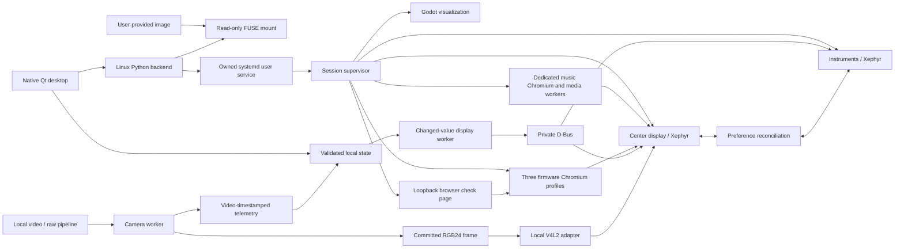

# Architecture

Infotainment Lab separates the native control panel from the device session. The
panel may close and reopen while the firmware windows, camera and other workers
continue running under one systemd user service.

## Native desktop and backend

`application.py`, `workspace.py`, `presentation.py` and `lab_panels.py` own the
native widgets, bilingual labels, device manager and the Camera & replay,
Browsers and Vehicle services panels. Launch choices are stored per image in
Qt's user settings. Pages scroll when content exceeds the window. Errors remain
visible independently of background polling.

`bridge.py` runs blocking backend commands in a Qt thread pool. Linux invokes
`/usr/bin/python3`; the optional Windows panel invokes that same backend in WSL
using argument arrays and path conversion. This keeps distribution packages
such as dbus-python outside the GUI's dedicated Qt environment.

`desktop_instance.py` uses a per-user lock and a user-restricted local Qt socket.
A second launch raises the existing panel and may add files to its import queue.
Windows shortcuts invoke WSLg directly. `Launch-Linux.sh` selects the packaged
executable or source environment and records startup output in the user's state
directory.

The Devices overview captures the actual nested displays every five seconds
while visible. Its previews are view-only. Display focus raises an owned
session window, and PNG export uses the same capture path at full resolution.

## Session ownership and lifecycle

`backend.py` owns import, preflight, build validation, lifecycle and diagnostic
exports. It copies the original runtime sources into stable user storage before
starting a service. The session therefore does not depend on the lifetime of a
packaged GUI's extraction directory. A single owned service avoids competing
instances on fixed firmware loopback endpoints.

`supervisor.py` builds four source adapters, allocates available nested X11
displays, starts a private D-Bus session and launches ordinary user processes
from the firmware's UI directory. Its working directory is significant because
firmware assets use relative paths. The supported MCU2 center canvas is
1200×1920 at 0.6 scale; the instruments use a separate display.

Recognized first-run configuration restarts have a bounded retry path. Each
Chromium mode has its own retry counter. The music workers and display link
also have two delayed recovery attempts. Other exits become visible errors or
degraded component status. Closing a firmware display ends the session. Stop
terminates the service's cgroup and unmounts this application's FUSE mounts;
it does not search for and kill unrelated vendor-named processes.

Restart validates the saved image references before stopping the active device.
Manual driving controls start in Park. A persisted replay source waits for Play
before resuming recorded inputs. Camera/service selections are kept. Closing
only the control panel leaves an active device and replay running.

## Chromium and input

`browser.py` defines normal Browser, Chromium Card and fullscreen/Theater
instances, each with a separate service identity and browser profile. The
backend requests views through the running center display's standard local
application methods. Browser/Card accept HTTP/HTTPS addresses; Theater opens
the firmware's own catalog. The visible Browser/Card buttons change the layout
of the same browser app and share its profile; this is separate from launching
the firmware's additional registered Chromium service instances.

`runtime/browser-page.py` serves the bundled interaction check on an ephemeral
port bound to `127.0.0.1`. It serves only that page, has no command endpoint or
directory listing, and stops with the device. This supplies a normal browser
origin for text/drag/audio/WebGL checks without hosting the native GUI.

The adapters in `runtime/` bridge exported Qt/X11 operations and host graphics.
`native-browser-input.c` translates embedded-view coordinates, maintains the
pressed pointer through motion and release, and handles wheel events and
browser geometry. Its keyboard path registers a public Qt4 event-dispatcher
filter for the touched browser and chains the previous filter for other events.
`native-compositor.c` refreshes the named pixmap after window
resize and supplies the compatibility rendering path. Firmware files are not
modified.

## Shared vehicle state

`simulation.py` validates the six manual driving inputs. `vehicle_services.py`
validates the wider local vehicle model and declares each domain's capabilities.
The native service panel submits partial changes, which the backend merges into
the current model before atomically replacing the requested state file.

`runtime/keep-awake.py` checks controls every 50 ms and applies changed native
values with readback. Unchanged control frames perform no bus I/O. Periodic
verification detects overwritten values; display-owner changes invalidate the
support cache. Host connectivity and disk probes run separately every 30 seconds.
A newly completed probe is delivered without waiting for the next probe cycle.

Vehicle speed stays precise in metres per second. MCU2 display speed is an
integer rounded in the chosen Miles/Kilometers units. Floating readback permits
only half of the interface's final rendered decimal digit. A successful setter
alone is never treated as evidence that a value was applied.

Native climate and audio request changes feed back into the same model and are
sent to both displays. Service feedback retains individual accepted, partial,
unsupported, rejected, mismatch and local-model states. Unverified tire units
remain in the local model; no guessed TPMS conversion is injected.

`runtime/display-link.py` reconciles supported preference changes from either
display. The last common value identifies which peer changed. Simultaneous
conflicts prefer the center display and are recorded; a restarted peer receives
the surviving display's state. Registered but unset fields can receive a valid
peer value. Unsupported fields are checked once per display owner rather than
repeatedly adding errors to firmware logs.

Audio volume/mute are also routed to PulseAudio streams whose executable resolves
inside the mounted firmware. Other applications' audio streams are untouched.
See [vehicle service scope and acknowledgements](vehicle-services.md).

## Camera and replay clock

`camera_source.py` validates camera selection. `runtime/camera-feed.py` produces
1280×720 RGB24 frames from a Pillow pattern, FFmpeg-decoded local video, a raw
upstream writer or a dashcam replay. Upstream files are read without modification;
only the decoder process and the session's frame output belong to this worker.
Missing or stale input clears the image and reports a waiting state.

`runtime/native-camera.c` adapts the project's existing V4L2 pipeline. It is
loaded by the center display, which reads `session/camera/back.rgb` through its
`/dev/video32` capture interface. Ordinary file descriptors pass through. The
firmware's own camera stream and camera view consume and render the image. The
local display configuration selects software capture without a physical
deserializer or DMA allocator.

`replay.py` reads embedded Tesla SEI telemetry from supported H.264 MP4 clips.
The MP4 presentation timestamps determine sample positions. The camera worker
commits a decoded RGB frame before publishing its corresponding driving data.
Pause holds both; seek waits for the target frame; a slow decoder slows data
with the picture. Playback rate and looping operate on this common clock.

Manual takeover and replay publication share an advisory lock. A pending manual
request prevents an in-flight frame from overwriting newer user controls. The
display worker accepts replay GPS/heading only when the status names a committed,
fresh frame whose control ownership is still valid. Recorded acceleration and
assistance-state codes remain metadata; no assistance controller is activated.
See [replay formats and transitions](replay.md).

Producer status reports frame freshness and source fps. The V4L2 adapter
independently reports actual dequeues and consumption fps. The GUI requires both
to be recent before showing firmware reception. Its optional preview reads the
same RGB output once per second. Only the native backup-camera view is validated.

## Local data

Data lives under `$XDG_DATA_HOME/tsla-infotainment-lab`, normally
`~/.local/share/tsla-infotainment-lab`.

| Path | Purpose |
| --- | --- |
| `library.json` | Image references and checksums; imported images stay in place. |
| `mounts/` | Read-only FUSE mounts keyed by image digest. |
| `engine/` | Stable copy of the repository's runtime sources. |
| `session/` | Owned config, logs, generated adapters and browser/display profiles. |
| `session/controls.json` | Current six driving inputs. |
| `session/vehicle-services.json` | Latest requested local vehicle model. |
| `session/*-feedback.json` | Per-display delivery and readback results. |
| `session/camera-source.json` | Selected camera/replay source. |
| `session/replay-request.json` and `replay-status.json` | Playback commands, clock, ownership and local recording metadata. |
| `session/display-link.json` | Display preference synchronization health. |
| `ui-venv/` | Source launcher's dedicated Qt environment. |

Public diagnostic exports use an allowlist. Firmware, recordings, GPS metadata,
browser contents, credentials and raw logs are excluded. Map
mounting establishes file availability. A street base map was observed after
valid replay GPS in a session without an offline map mounted. This does not
verify use of the supplied NA package, offline imagery or route computation.
