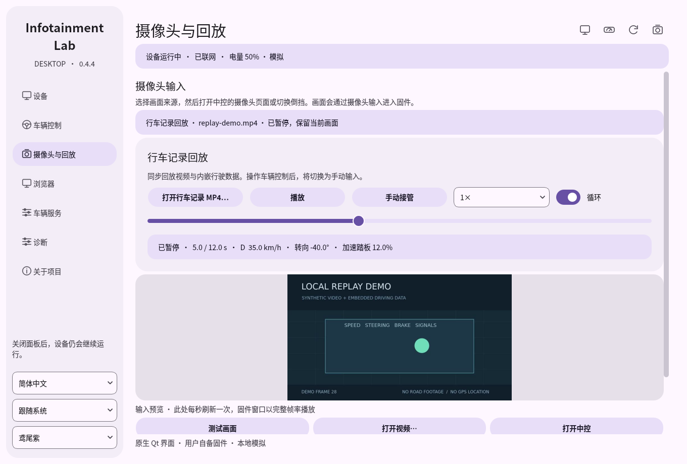

# QEMU virtual desktop / QEMU 虚拟桌面

This experimental mode runs the firmware applications inside a Linux VM, using
a replacement kernel with VirtIO drivers and the project's local compatibility
runtime. The source firmware is attached read-only. It has its own desktop disk,
kernel, initramfs, logs and shutdown controls.

此实验模式在 Linux 虚拟机内运行固件应用，使用支持 VirtIO 的替代内核与本项目的
本地兼容运行环境。原始固件只读挂载；客体系统盘、内核、日志和关机控制独立保存。

## Verified configuration / 已验证配置

Tested with **2026.26.6.1 MCU2**, Debian WSLg, QEMU/KVM and Debian's packaged
`7.1.8+deb13-amd64` kernel. This is not a locally compiled Tesla kernel.
The guest CPU reports the host AMD
Ryzen model through KVM; GPU acceleration uses VirtIO/VirGL and does not require
an emulated Radeon PCI device or an AMDGPU module in the firmware kernel.

| Item / 项目 | Result / 结果 |
| --- | --- |
| Center / 中控 | Actual firmware UI, 720 × 1152, native QEMU window |
| Center graphics / 中控图形 | `virgl (D3D12 (AMD Radeon(TM) Graphics))`, accelerated |
| Instruments / 仪表盘 | Actual firmware UI and vehicle visualization, 1280 × 480, separate native window |
| Instrument graphics / 仪表图形 | AMD-backed VirGL through VirtualGL; separate instrument window |
| Chromium | Browser check page visible inside the firmware's browser card |
| Internet / 联网 | Guest HTTPS request to Debian returned HTTP 200 |
| Audio / 音频 | Buffered WSLg output: two 30-second and one 120-second guest tones, embedded Chromium audio, idle/resume and Qt stop/start verified; long sessions and streaming playback still need validation |
| Local controls / 本地模拟 | Qt controls reach both displays; gear enum readback and speed-unit labels are corrected. A 100 km/h input displays 100 km/h or 62 MPH according to the selected units. |
| Qt panel / Qt 面板 | Saved QEMU mode and guest directory, start/stop, dual previews, display focus, browser card and vehicle controls |
| Camera / 摄像头 | Selected video and changing RGB frames reach the guest; the actual firmware camera consumer reports frames |
| Replay / 回放 | Qt selection, play, pause and seek verified with embedded telemetry; remaining replay behaviors need parity validation |

The two displays use separate Xorg servers and GPUs. Putting the firmware apps
on one shared X server allowed their window managers to interfere with browser
windows. The instrument window uses 2D VirtIO for presentation. VirtualGL redirects its
OpenGL work, including the firmware vehicle visualization, to the center GPU.
Both applications report the AMD-backed VirGL renderer. A failed offload probe
retains software rendering and reports the reason. The native Qt stop/start
check preserved both accelerated displays; embedded Chromium audio also reached
the host output monitor after that restart, with zero output-queue drops.
Status reports each renderer separately and rejects stale session heartbeats.

Actual guest-screen captures from the generated VM disk / 构建盘启动后的真实客体截图：


The native Qt panel controlling a running QEMU session, paused at a recorded
telemetry frame / 原生 Qt 面板连接运行中的 QEMU，暂停在包含行驶数据的回放帧：



双屏分别使用独立 Xorg 服务和虚拟显卡，避免两个固件窗口管理器争抢浏览器窗口。
仪表盘通过 VirtualGL 共用中控的 VirGL 加速，二维 VirtIO 负责独立窗口显示；
启动时验证实际渲染器，验证失败则保留软件渲染并报告原因。状态查询排除上次
启动遗留的状态。ICE 在此虚拟机模式下尚未完成运行验证。

## Build / 构建

Run inside Debian, from the repository directory. The output directory must be
new and its parent must exist. The builder downloads Debian packages and the
SHA-256-pinned VirtualGL 3.1.5 package from its official GitHub release; allow
space for the staging filesystem and a 16 GiB sparse guest disk. It does not
install a kernel on the host. Building requires root; launching uses your normal
desktop user with access to `/dev/kvm` and an X11 desktop or WSLg.

在 Debian 内、项目根目录执行。输出目录必须尚不存在，父目录需已存在。构建会下载
Debian 包，并生成暂存文件系统及 16 GiB 稀疏系统盘；不会安装主机内核。构建需要
root，启动则使用具备 KVM 权限的普通桌面用户。

```sh
sudo apt-get install debootstrap qemu-system-x86 qemu-system-gui e2fsprogs pulseaudio-utils
vm_dir="$HOME/.local/share/tsla-infotainment-lab/virtual-desktop"
mkdir -p "$(dirname "$vm_dir")"
sudo python3 scripts/build-virtual-guest.py --directory "$vm_dir" --owner "$(id -un)"
```

WSLg also needs `pulseaudio` for the private VM audio service. Qt's preparation
action installs it automatically. Native Linux uses the existing desktop audio
server, including PulseAudio-compatible PipeWire, without replacing it.

WSLg 还需要 `pulseaudio` 作为虚拟机专用音频服务，Qt 准备流程会自动安装。
原生 Linux 沿用现有桌面音频服务，包括提供 PulseAudio 接口的 PipeWire。

On WSLg with AMD graphics, the optional selector verifies the renderer before
saving the application preference: / WSLg 下可先验证并保存 AMD 渲染器选择：

```sh
python3 -m infotainment_lab.host_graphics AMD
```

## Updating the guest / 更新客体

The guest disk contains its own copy of the runtime. To pick up guest-side fixes
from a new release, build into a new directory with that release, stop the old VM,
and select the new directory in the device manager. Keep the previous directory
if you want to switch back.

客体磁盘保存了一份独立的运行代码。升级后，请用新版在新目录中构建客体，
停止旧虚拟机，再从设备管理器选择新目录。保留旧目录即可随时切回。

## Launch and stop / 启动与关机

In the Qt device manager, choose **QEMU virtual machine**, select the prepared
guest directory and your imported firmware, then use **Start**. The same panel
provides driving inputs, steering-wheel buttons, browser actions and camera/replay
controls. Mode and directory cannot change while the VM is running. The separate
**QEMU boot check** action still diagnoses the firmware's original kernel.

The volume hold/release check increased volume from 20 to 35 during a 4.2-second
press and confirmed it stayed at 35 after release. A paused replay retained its
frame after 6.5 seconds; the panel distinguishes a held frame from live footage.

在 Qt 设备管理器选择 **QEMU 虚拟机**，填写已构建的客体目录并选择导入的固件，
然后点击启动。驾驶输入、方向盘按钮、浏览器和摄像头回放通过同一控制面板操作。
虚拟机运行时不能切换模式或目录；独立的 **QEMU 启动检查** 仍用于原厂内核诊断。

Supply your own locally obtained firmware dump. No firmware or extraction
instructions are provided by this project. Use a new VM directory for a different
firmware version so application state is not mixed between versions.

固件 Dump 需自行准备；项目不提供固件，也不提供导出教程。不同固件版本请使用独立
虚拟机目录，避免混用应用状态。

```sh
python3 -m infotainment_lab.qemu_virtual start \
  --directory "$vm_dir" --firmware "/path/to/2026.26.6.1.mcu2"
python3 -m infotainment_lab.qemu_virtual status --directory "$vm_dir"
python3 -m infotainment_lab.qemu_virtual stop --directory "$vm_dir"
```

`stop` requests ACPI shutdown; wait until `status` says `stopped` before launching
again. QMP UUID and process start time are checked before controlling the guest.
Internet uses QEMU user networking without port forwards. Selected camera and
replay files are copied into the VM's private `inputs` folder, mounted read-only
inside the guest. Live RGB input is relayed into that folder; arbitrary host
directories are not exposed.
`--offline` restricts that network. `--single-display` selects the landscape
center layout for experimental single-display firmware.

`stop` 发出正常关机请求，需等待状态变为 `stopped` 后再启动。网络使用 QEMU 用户态
联网，没有端口转发；`--offline` 可限制联网。所选视频复制到虚拟机专用 `inputs`
目录并只读挂载，实时 RGB 管线也通过此目录转发，不共享任意主机目录。

Local simulation example / 本地模拟示例：

```sh
python3 -m infotainment_lab.qemu_virtual controls --directory "$vm_dir" \
  --payload '{"gear":"D","speed_kph":30,"indicator":"right"}'
python3 -m infotainment_lab.qemu_virtual controls --directory "$vm_dir" \
  --payload '{"gear":"P","speed_kph":0,"indicator":"off"}'
```

The response confirms delivery to the guest, not acceptance by every firmware
service. `session/controls-feedback.json` inside the guest contains readback.
Diagnostics are in `vm-launch.log`, `vm-serial.log`, the guest's
`journalctl -u lab-desktop`, and `/home/lab/session/*.log`.

## Remaining work / 待完成

Long-session audio validation,
streaming-service login/playback, map navigation, every vehicle-service control
and complete camera/replay parity remain unfinished. The newest GUI preparation
flow and packaged release also need a clean-machine validation. Process liveness
alone does not verify these functions.

音频长时间运行验证、流媒体登录播放、地图导航、全部车辆服务
以及摄像头回放完整功能等效仍待验证或修复。最新 GUI 准备流程与打包版本还需在
干净环境验证；进程存活不代表这些功能已通过验证。

## Audio behavior / 音频运行方式

On WSLg, a private audio service gives the virtual sound card a steady clock.
It forwards PCM to the desktop output when sound is present and closes that
output after one second of digital silence. The requested output buffer is
120 ms. A blocked desktop output has a bounded queue and cannot freeze the VM.
The service and its players exit with the VM; no TCP audio port or global audio
configuration is added. Diagnostics include output state and dropped-byte counts.

WSLg 模式使用专用音频服务为虚拟声卡提供稳定时钟，有声音时连接桌面输出，连续
一秒数字静音后释放输出流。请求的输出缓冲为 120 ms，队列有长度限制，桌面音频
阻塞不会拖住虚拟机。音频服务随虚拟机退出，不新增 TCP 音频端口，不改全局音频
配置。诊断报告包含输出状态及丢弃数据计数；已验证主机输出监测中的实际音频信号。
