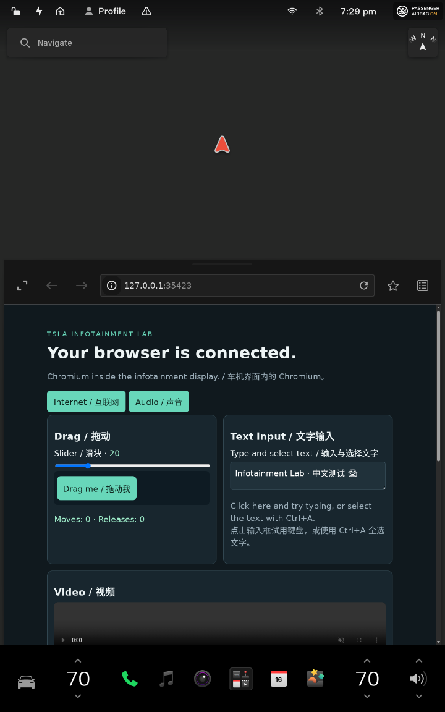
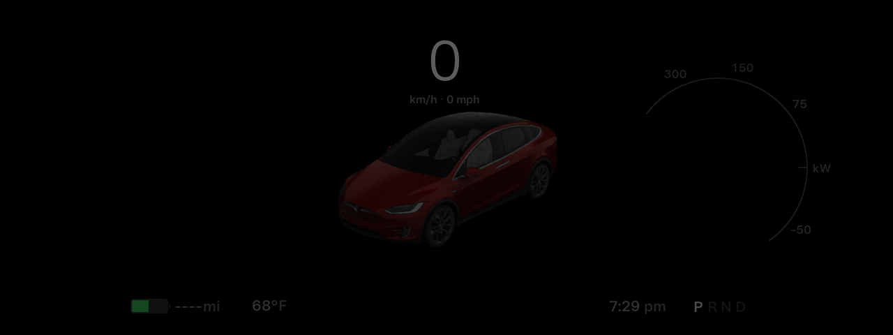

This experimental mode runs the firmware applications inside a Linux VM, using
a replacement kernel with VirtIO drivers and the project's local compatibility
runtime. The source firmware is attached read-only. It has its own desktop disk,
kernel, initramfs, logs and shutdown controls.

## Verified configuration

Tested with **2026.26.6.1 MCU2**, Debian WSLg, QEMU/KVM and Debian's packaged
`7.1.8+deb13-amd64` kernel. This is not a locally compiled Tesla kernel.
The guest CPU reports the host AMD
Ryzen model through KVM; GPU acceleration uses VirtIO/VirGL and does not require
an emulated Radeon PCI device or an AMDGPU module in the firmware kernel.

| Item | Result |
| --- | --- |
| Center | Actual firmware UI, 720 × 1152, native QEMU window |
| Center graphics | `virgl (D3D12 (AMD Radeon(TM) Graphics))`, accelerated |
| Instruments | Actual firmware UI and vehicle visualization, 1280 × 480, separate native window |
| Instrument graphics | AMD-backed VirGL through VirtualGL; separate instrument window |
| Chromium | Browser check page visible inside the firmware's browser card |
| Internet | Guest HTTPS request to Debian returned HTTP 200 |
| Audio | Buffered WSLg output: two 30-second and one 120-second guest tones, embedded Chromium audio, idle/resume and Qt stop/start verified; long sessions and streaming playback still need validation |
| Local controls | Qt controls reach both displays; gear enum readback and speed-unit labels are corrected. A 100 km/h input displays 100 km/h or 62 MPH according to the selected units. |
| Qt panel | Saved QEMU mode and guest directory, start/stop, dual previews, display focus, browser card and vehicle controls |
| Camera | Selected video and changing RGB frames reach the guest; the actual firmware camera consumer reports frames |
| Replay | Qt selection, play, pause and seek verified with embedded telemetry; remaining replay behaviors need parity validation |

The two displays use separate Xorg servers and GPUs. Putting the firmware apps
on one shared X server allowed their window managers to interfere with browser
windows. The instrument window uses 2D VirtIO for presentation. VirtualGL redirects its
OpenGL work, including the firmware vehicle visualization, to the center GPU.
Both applications report the AMD-backed VirGL renderer. A failed offload probe
retains software rendering and reports the reason. The native Qt stop/start
check preserved both accelerated displays; embedded Chromium audio also reached
the host output monitor after that restart, with zero output-queue drops.
Status reports each renderer separately and rejects stale session heartbeats.

Actual guest-screen captures from the generated VM disk





## Build

Run inside Debian, from the repository directory. The output directory must be
new and its parent must exist. The builder downloads Debian packages and the
SHA-256-pinned VirtualGL 3.1.5 package from its official GitHub release; allow
space for the staging filesystem and a 16 GiB sparse guest disk. It does not
install a kernel on the host. Building requires root; launching uses your normal
desktop user with access to `/dev/kvm` and an X11 desktop or WSLg.

```sh
sudo apt-get install debootstrap qemu-system-x86 qemu-system-gui e2fsprogs pulseaudio-utils
vm_dir="$HOME/.local/share/tsla-infotainment-lab/virtual-desktop"
mkdir -p "$(dirname "$vm_dir")"
sudo python3 scripts/build-virtual-guest.py --directory "$vm_dir" --owner "$(id -un)"
```

WSLg also needs `pulseaudio` for the private VM audio service. Qt's preparation
action installs it automatically. Native Linux uses the existing desktop audio
server, including PulseAudio-compatible PipeWire, without replacing it.

On WSLg with AMD graphics, the optional selector verifies the renderer before

```sh
python3 -m infotainment_lab.host_graphics AMD
```

## Updating the guest

The guest disk contains its own copy of the runtime. To pick up guest-side fixes
from a new release, build into a new directory with that release, stop the old VM,
and select the new directory in the device manager. Keep the previous directory
if you want to switch back.

Guest images built before the Console's SSH support need a rebuild: current
builds of `scripts/build-virtual-guest.py` include an SSH server with key-only
login. **Console › Connect** (or **Set up SSH key**) creates a lab-owned ed25519
key, authorizes it through the guest agent and connects over the loopback-only
forward `127.0.0.1:2222`, then enters the firmware image mounted read-only at
`/firmware` in the guest. If the image is not mounted, it says so and leaves you
in the guest shell.

## Launch and stop

In the Qt device manager, choose **QEMU virtual machine**, select the prepared
guest directory and your imported firmware, then use **Start**. The same panel
provides driving inputs, steering-wheel buttons, browser actions and camera/replay
controls. Mode and directory cannot change while the VM is running. The separate
**QEMU boot check** action still diagnoses the firmware's original kernel.

The volume hold/release check increased volume from 20 to 35 during a 4.2-second
press and confirmed it stayed at 35 after release. A paused replay retained its
frame after 6.5 seconds; the panel distinguishes a held frame from live footage.

Supply your own locally obtained firmware dump. No firmware or extraction
instructions are provided by this project. Use a new VM directory for a different
firmware version so application state is not mixed between versions.

```sh
python3 -m infotainment_lab.qemu_virtual start \
  --directory "$vm_dir" --firmware "/path/to/2026.26.6.1.mcu2"
python3 -m infotainment_lab.qemu_virtual status --directory "$vm_dir"
python3 -m infotainment_lab.qemu_virtual stop --directory "$vm_dir"
```

`stop` requests ACPI shutdown; wait until `status` says `stopped` before launching
again. QMP UUID and process start time are checked before controlling the guest.
Internet uses QEMU user networking without port forwards. Selected camera and
replay files are copied into the VM's private `inputs` folder, mounted read-only
inside the guest. Live RGB input is relayed into that folder; arbitrary host
directories are not exposed.
`--offline` restricts that network. `--single-display` selects the landscape
center layout for experimental single-display firmware.

Local simulation example

```sh
python3 -m infotainment_lab.qemu_virtual controls --directory "$vm_dir" \
  --payload '{"gear":"D","speed_kph":30,"indicator":"right"}'
python3 -m infotainment_lab.qemu_virtual controls --directory "$vm_dir" \
  --payload '{"gear":"P","speed_kph":0,"indicator":"off"}'
```

The response confirms delivery to the guest, not acceptance by every firmware
service. `session/controls-feedback.json` inside the guest contains readback.
Diagnostics are in `vm-launch.log`, `vm-serial.log`, the guest's
`journalctl -u lab-desktop`, and `/home/lab/session/*.log`.

## Remaining work

The Service Mode panel, network isolation, Vehicle config, Alerts and the CAN
service were built and checked on the native engine and have not been validated
inside the guest. The VM is verified only with 2026.26.6.1; other MCU2 builds use
the experimental generic profile. Long-session audio validation,
streaming-service login/playback, map navigation, every vehicle-service control
and complete camera/replay parity remain unfinished. The newest GUI preparation
flow and packaged release also need a clean-machine validation. Process liveness
alone does not verify these functions.

## Audio behavior

On WSLg, a private audio service gives the virtual sound card a steady clock.
It forwards PCM to the desktop output when sound is present and closes that
output after one second of digital silence. The requested output buffer is
120 ms. A blocked desktop output has a bounded queue and cannot freeze the VM.
The service and its players exit with the VM; no TCP audio port or global audio
configuration is added. Diagnostics include output state and dropped-byte counts.

